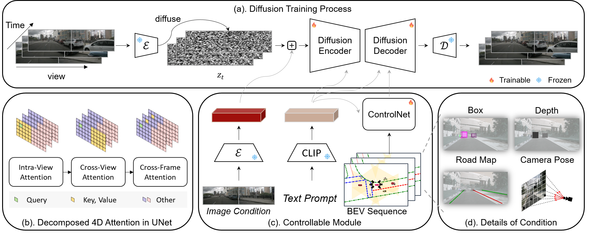
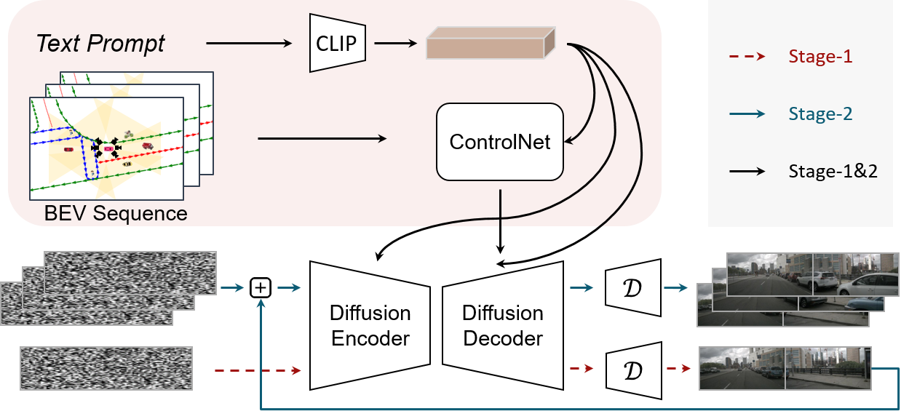
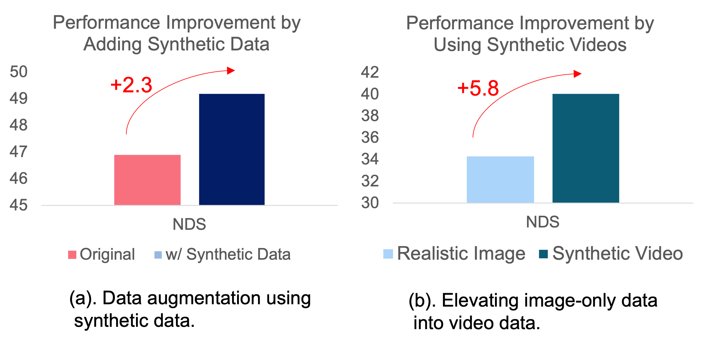

# Panacea: Panoramic and Controllable Video Generation for Autonomous Driving
**Official Repository of Panacea.**

> [Paper] [**Panacea: Panoramic and Controllable Video Generation for Autonomous Driving**](https://arxiv.org/abs/2311.16813),            
Yuqing Wen1*&dagger;, Yucheng Zhao2*,Yingfei Liu2*, 
            Fan Jia2, 
            Yanhui Wang1, Chong Luo1,
            Chi Zhang3, 
            Tiancai Wang2&Dagger;, 
            Xiaoyan Sun1&Dagger;,
            Xiangyu Zhang2  
            1University of Science and Technology of China, 
            2MEGVII Technology, 
            3Mach Drive  
*Equal Contribution, 
            &dagger;This work was done during the internship at MEGVII, 
            &Dagger;Corresponding Author.

> [WebPage] https://panacea-ad.github.io/

        <h1 class="section-name">Generating Multi-View and Controllable Videos for Autonoumous Driving</h1>
        
        
<strong>Overview of Panacea. </strong>(a). The diffusion training process of Panacea, enabled by a diffusion encoder and decoder with the decomposed 4D attention module. (b). The decomposed 4D attention module comprises three components: intra-view attention for spatial processing within individual views, cross-view attention to engage with adjacent views, and cross-frame attention for temporal processing. (c). Controllable module for the integration of diverse signals. The image conditions are derived from a frozen VAE encoder and combined with diffused noises. The text prompts are processed through a frozen CLIP encoder, while BEV sequences are handled via ControlNet. (d). The details of BEV layout sequences, including projected bounding boxes, object depths, road maps and camera pose.

        
        
<strong>The two-stage inference pipeline of Panacea.</strong> Its two-stage process begins by creating multi-view images with BEV layouts, followed by using these images, along with subsequent BEV layouts, to facilitate the generation of following frames.

        <h1 class="section-name">&#127916;&nbsp;&nbsp; BEV-guided Video Generation &nbsp;&nbsp;&#127916;</h1>
        <table style="width: 100%;">
            <tbody>
                <tr class="result-row">
                    <td>
                        
                    </td>
                </tr>
                <tr class="result-row">
                  <td>
                      
                  </td>
                </tr>
            </tbody>
        </table>
        
<strong>Controllable multi-view video generation. Panacea is able to generate realistic, controllable videos with good temporal and view consistensy.</strong>

    <h1 class="section-name">&#127902;&nbsp;&nbsp; Attribute Controllable Video Generation &nbsp;&nbsp;&#127902;</h1>
    <table style="width: 100%;">
        <tbody>
          <tr class="result-row">
            <td>
                
            </td>
        </tr>
        </tbody>
    </table>
    
<strong>Video generation with variable attribute controls, such as weather, time, and scene, which allows Panacea to simulate a variety of rare driving scenarios, including extreme weather conditions such as rain and snow, thereby greatly enhancing the diversity of the data.</strong>

  <h1 class="section-name">&#128293;&nbsp;&nbsp; Benefiting Autonomous Driving  &nbsp;&nbsp;&#128293;</h1>
  <table style="padding-left: 120px;width: 90%;">
      <tbody>
        <tr class="result-row">
          <td>
              
          </td>
      </tr>
      </tbody>
  </table>
  
<strong> (a). Panoramic video generation based on BEV (Bird’s-Eye-View) layout sequence facilitates the establishment of a synthetic video dataset, which enhances perceptual tasks. (b). Producing panoramic videos with conditional images and BEV layouts can effectively elevate image-only datasets to video datasets, thus enabling the advancement of video-based perception techniques.</strong>

    

        

            <h1 class="section-name" style="margin-top: 30px; text-align: left; font-size: 25px;">
                BibTex
            </h1>
            
            <pre style="margin-top: 5px;" class="bibtex">
                <code>
@artical{@misc{wen2023panacea,
    title={Panacea: Panoramic and Controllable Video Generation for Autonomous Driving}, 
    author={Yuqing Wen and Yucheng Zhao and Yingfei Liu and Fan Jia and Yanhui Wang and Chong Luo and Chi Zhang and Tiancai Wang and Xiaoyan Sun and Xiangyu Zhang},
    year={2023},
    eprint={2311.16813},
    archivePrefix={arXiv},
    primaryClass={cs.CV}
}
}</code></pre>
        

        

            <h1 class="section-name" style="margin-top: 0px; margin-bottom: 10px; text-align: left; font-size: 25px;">
                Contact
            </h1>
            

                Feel free to contact us at <strong>wenyuqing AT mail.ustc.edu.cn</strong> or <strong>wangtiancai AT megvii.com</strong>
        

    

